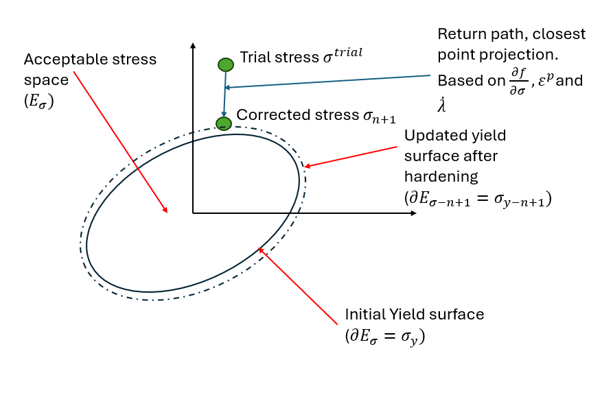

# Week 2 - Reading notes
- Simo & Hughes: Chapter 1, Section 1.4.2 (Return-Mapping Algorithms)
- Dunne & Petrinic: Chapter 5, Sections 5.1-5.3 (Implicit integration)

## Questions:
### 1. Elastic Predictor Step
#### 1.1 What is the "trial elastic state"? Formula: $\sigma^{trial} = E(\varepsilon - \varepsilon_p) (dim=1D)$
The trial elastic state or trial stress is a guess of the stress state at the next load increment (n+1). The formula can also be written

$$ \sigma^{trial}=\sigma_{n} + \Delta\sigma-E\varepsilon^{p}$$

where

$$ \Delta\sigma =  E\Delta \varepsilon_{n+1} $$

A more general expression can be written:

$$ \sigma^{trial}= \mathbf{D}^{e}:(\varepsilon_{n+1}-\varepsilon^{p}_{n}) $$

or in incremental form

$$ \sigma^{trial}= \mathbf{D}^{e}:(\varepsilon_{n}+\Delta\varepsilon_{n+1}-\varepsilon^{p}_{n}) \tag{1} $$

#### 1.2 When does this violate yield?

Yielding occurs when the yield criterion $f(\sigma;\sigma_{y})$ or $f(\sigma,\alpha; \kappa) > 0$. In the perfect plasticity case, using Von Mises yield condition, $f$ take the form:

$$ f(\sigma;\sigma_{y}) = \sqrt{||\sigma||^2-\tfrac{1}{3}(tr(\sigma))^2}-\sqrt{\tfrac{2}{3}\sigma_{y}} \tag{Simo 2.3.1}$$

The idea is to compare the actual stress in the next increment against the actual yield stress. If the difference between the actual and yield stress respectively is greate than 0, if means that yielding is occuring.

The choice of word is important here. By "current yield stress" it means that for perfect plasticity it cannot be change, but when isotropic and/or kinematic hardening occur, the yield stress change over time, or over the evolution of the strain path.


### 2. Plastic Corrector Step
#### 2.1 How do we return to yield surface?
The plastic corrector is used to essentially "correct" the $\sigma^{trial}$ guess. We could write it this way:

$$ f(\sigma;\sigma_{y})= \text{current stress} + \text{stress increment} - \text{plastic corrector} = 0 $$

Here and always, $f(\bullet)\leq0$
#### 2.2 What is the "closest point projection"?
We can see the trial stress as a point in the stress space. The stress now has to be "projected" back onto the yield surface to respect Kuhn-Tucker conditions ($f\leq 0$, $\dot{\lambda}\geq 0$ and $\dot{\lambda}f=0$).

To project the trial state back onto the yield surface, both the derivative of an operator $\mathcal{L}$, with respect to $\sigma$ and $\alpha$ must equal zero. This is called the standard optimality condition. This ensure that this is the closest projection of the trial state onto on the yield surface

#### 2.3 Formula for return direction
In a perfectly plastic case, the corrector is the plastic strain increment, given by:

$$ \Delta\varepsilon^{p}_{n+1}=\dot{\lambda}\dfrac{\partial f(\sigma_{n+1},q_{n+1})}{\partial \sigma}$$

This, then take equation $(1)$ and increase the plastic strain (in the context of perfect plasticity):

$$ \sigma_{n+1}= \mathbf{D}^{e}:(\varepsilon_{n}+\Delta\varepsilon_{n+1}-(\varepsilon^{p}_{n}+\Delta\varepsilon^{p}_{n+1}) \tag{2}) $$

### 3. Algorithm in Pseudocode
Below is the pseudo code for return mapping. In the next section, a step by step example will be shown for 1D plasticity.
```python
sigma_trial = Compute trial stress
if sigma_trial <= 0:
    sigma = sigma + delta_sigma
else # Yielding -> return mapping
    compute plastic strain increment d_eps_p
    compute accumulated plastic strain increment d_alpha

    return corrected stress, updated plastic strain, updated    accumulated plastic strain
```

#### 3.1 Step-by-step for 1D plasticity. Include: elastic check, return mapping, variable updates
Here is the complete algorithm for 1D, perfect plasticity. This code is taken from the code assignement for week 2 in:```\code\week02\plasticity_1d_hardening.py```
```python
def return_mapping_isotropic_hardening(eps_n, d_eps, eps_p_n, alpha_n, E, sigma_y0, H):
    """
    1D return mapping with linear isotropic hardening
    
    Parameters:
    -----------
    eps_n : float
        Total strain at previous step n
    d_eps : float
        Strain increment (eps_{n+1} - eps_n)
    eps_p_n : float
        Plastic strain at previous step n
    alpha_n : float
        Accumulated plastic strain at previous step n
    E : float
        Young's modulus [Pa]
    sigma_y0 : float
        Initial yield stress [Pa]
    H : float
        Hardening modulus [Pa]
    
    Returns:
    --------
    sigma : float
        Stress at step n+1 [Pa]
    eps_p : float
        Plastic strain at step n+1
    alpha : float
        Accumulated plastic strain at step n+1
    """
    # Total strain in current increment
    eps_n = eps_n + d_eps
    
    # Current yield stress
    sig_y = lambda : sigma_y0 + H*alpha_n
    
    # Yield function
    sigma_eq = lambda eps_n, d_eps, eps_p_n :  E*(eps_n + d_eps - eps_p_n)

    # Yield criterion
    f = lambda sigma_e, sigma_y : np.abs(sigma_e) - sigma_y # simo 2.2.37
            
    # Check yield condition
    sigma_e = sigma_eq(eps_n, d_eps, eps_p_n)
    f_e = f(sigma_e, sig_y())

    if f_e <= 0: # elastic case
        return sigma_e, eps_p_n, alpha_n
    else: # f > 0 compute plastic corrector

        # Compute plastic multiplier
        delta_gamma = f_e / (E + H) 

        # Compute plastic strain increment
        d_eps_p = delta_gamma * np.sign(sigma_e)
        eps_p_n += d_eps_p 

        # Compute accumulated plastic strain
        alpha_n += delta_gamma

        # Compute stress
        sigma = (1-delta_gamma*E/np.abs(sigma_e)) * sigma_e
               
        return sigma, eps_p_n + d_eps_p, alpha_n
```


### 4. Geometric Interpretation

##### 4.1 Draw a sketch (hand-drawn is fine, scan/photo). Show: yield surface, trial state, return path, final state. Label: $\sigma^{trial},\sigma^{n+1}, \Delta\lambda$
Here is the geometric interpretation of the return mapping algorithm in isotropic hardening
