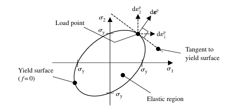

# Week 1 reading notes
## Computational Plasticity, chapter 2
- Under plastic deformation, we can assume that there is two different strain
  - Elastic strain $\varepsilon^{e}$
  - Plastic strain $\varepsilon^{p}$
  - Total strain $\varepsilon=\varepsilon^{e}+\varepsilon^{p}$
- We say that loading occur when the stress rises with loading and that the slope of the stress strain curve can change depending on if the material is under plastic deformation or not ($\varepsilon_{p}\neq0$)
- We say that unloading occurs when the stress levels is getting lower, thus the slope of the stress strain curve is most likely changing from $\dfrac{d\sigma}{d\varepsilon^{p}}$ to $E$ where $E$ is the *Young's modulus*. In this context, $E=\dfrac{d\sigma}{d\varepsilon^{e}}=constant$
- Since we accepted that under plastic deformation, the incompressibility condition is respected (volume is constent), we can then determine
- Since not all loading is uniaxial, effective stress and strains can be computed with the Von Mises equivalent stress. It is not mentionned in the book but the Von Mises equavalent stress is and only is applicable for isotropic materials.
- VM equivalent stress can be computed using the *deviatoric stress*, meaning that a stress state can be defined by excluding the hydrostatic stress. This makes sens since the hydrostatic stress is equal in all three direction for $\sigma_{ii}$.
- A yield function determines if the stress state is plastic or elastic by using $f=\sigma_{e}-\sigma_{y}$.
  - While $f<0$, loading is elastic
- As long as $\sigma_{11}=\sigma_{22}=\sigma_{33}$, no yielding occurs. If we take a cut at the plane $\sigma_{33}=\sigma_{z}=0$, we get this:

- Meaning that is the equivalent stress is greater or equal to $\sigma_y$, the yield surface will change according to the direction of $d\mathbf{\varepsilon_{p}}$
- Normality hypothesis of plasticity: The plastic flow is in a direction, normal to the tangent at a point on the yield surface. See previous image. Where the increment of plastic strain is:
$$d\varepsilon^{p}=d\lambda\dfrac{\partial f}{\partial\sigma}=\dfrac{3}{2}d\lambda \dfrac{\mathbf{\sigma}'}{\sigma_e}$$ 
where $\lambda$ is the plastic multiplider and $d\lambda$ the reate of change in the plastic multiplier. 
- Consistency condition: the stress state (**load point**) must remain on the yield surface $\rightarrow$ detemine the plastic multiplier:
  $$f(\mathbf{\sigma},p)=\sigma_{e}-\sigma_{y}=
  \sigma_{e}(\mathbf{\sigma})-\sigma_{y}(p)
  =0$$
For an incremental change in stress and plastic strain, we get:
$$\dfrac{\partial f}{\partial \mathbf{\sigma}}\cdot d\sigma +
    \dfrac{\partial f}{\partial p}\cdot dp = 0$$
and using Hook's law:
$$ d\mathbf{\sigma} = \mathbf{C}d\mathbf{\varepsilon^{e}}=\mathbf{C}(d\mathbf{\varepsilon}-d\mathbf{\varepsilon^{p}}) $$
$$d\mathbf{\sigma}=\mathbf{C}(d\mathbf{\varepsilon}-d\lambda\dfrac{\partial f}{\partial\sigma}) $$
- Ultimately, the increment of stress is detemine using the tangential stiffness matrix $\mathbf(C_{ep})$ with:
$$d\mathbf{\sigma}=\mathbf{C_{ep}}d\mathbf{\varepsilon} $$
See equation 2.32 at page 37 for definition of the tangent stiffness matrix.
- Isotropic hardening: the yield surface expands equally in all directions. Thus the yield surface expands according to an equation $\sigma_{y}(p)=\sigma_{y0}+r(p)$ thus:
  $$f(\mathbf{\sigma},p)=\sigma_{e}-\sigma_{y0}-r(p)$$
- Linear isotropic hardening ($dr(p)=hdp$)

## Simo - Inelasticity, chapter 1
- Will be less elaborate than the note on *Computational Plasticity* since the subject is similar
- The yield function is either smaller than 0 or equal to zero. If it is equal to zero, it implies that there is plastic strain. If not, it means that the stress state is elastic.
- The Kuhn-Tucker condition implies that $\gamma f(\mathbf{\sigma})=0$
- The consistency condition implies that $\gamma \dot{f}(\mathbf{\sigma})=0$
- Here, $d\lambda$ from Dunn is called the *slip rate* and is $\gamma$:
  $$d\varepsilon^{p}=\gamma \dfrac{\partial f}{\partial \mathbf{\sigma}}$$ 

## Questions
### Dunne and Petrinic
1. What is the von Mises yield criterion?
- The VM equivalent stress if based on the J2 stress invariant. The VM equivalent stress (f) is equal to the difference between the equivalent stress and the yield stress that can be a function of plastic strain
2. What is the **flow rules** and hwat **associated** mean?
- The flow rule defines the plastic strain flow direction. See definition of associated below
- Associated mean that the flow direction is based on the normal to the tangent at a loading point on the yield surface, where any subsequent loading induce plastic flow
3. How does isotropic hardening modify the yield surface.
- Isotropic hardening mean that for any plastic strain increase, the yield surface expands in such a way that it is equal in all principal direction.

### Simo and Hughes
4. How does the 1D friction model relate to plasticity?
- The simple friction/slip model takes into acound the elasticity of a spring (for the elastic part) and a sliping part that is not going back (for the plastic part). So, when a stress is applied the elastic part takes as much as it can, and once the limit of the friction element is reached (analogy of yield stress), the part starts to slip and keep this displacement as long as the stress keep rising (hardening) or beeing constant (perfectly plastic)
5. What are the **loading/unloading conditions**
- Loading is when f=0, unloading is when f<0. Where $f(\sigma)=|\sigma|-[\sigma_{y}+K\alpha]<=0$
6. What is **return mapping**
- When the actual stress state is returned to the yield surface after an initial guess. The initial guess is most likely the Young's modulus times the equivalent strain. When the strain is high enough, this make f >= 0 for a moment (with the initial guess) and then returned to the yield surface

## Confusing concept
- Difference between associative and non associative
- The physical signifiance of $\lambda$ the plastic multiplier(Dunn)/slip rate(Simo)
- When is f(sigma)=0 supposed to happen so that the Kuhn-Tucker condition is respected

## Questions for next 
- How is the isotropic hardening behavior changing for multiaxial stress state? Formulas used are all based on uniaxial stress state.
