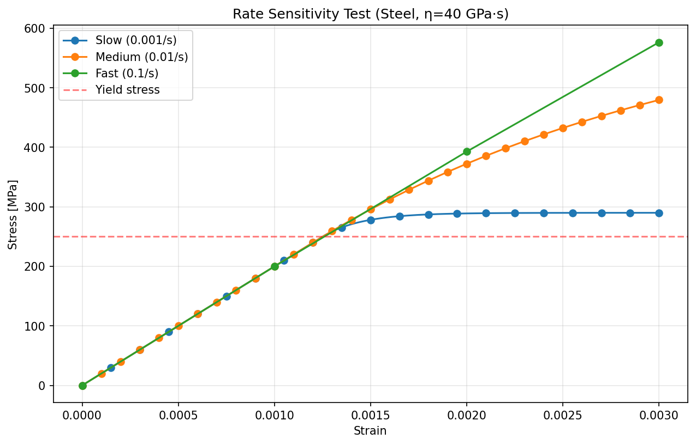

# Week 3 - Reading notes
- Simo & Hughes: Chapter 1, Section 1.7 (1D Viscoplasticity)
- Dunne & Petrinic: Chapter 2, Sections 2.7 (Viscoplasticity and creep)

## 1. Rate-Dependent vs Rate-Independent Plasticity
### What's the fundamental difference?
Rate independent means that the rate at which the material is deformed, doesn't have any impact on material properties. Rate dependent means the opposite. For example, some steels at elevated temperature exhibit rate dependance. Higher strain rate means higher yield stress and most likely lower strain at failure. Lower strain means lower yield stress and for very low strain rate the material could exhibit creep.

### Kuhn-Tucker conditions vs viscoplastic flow rule
The Kuhn-Tucker conditions specify that for any stress state, $\lambda f=0$, $\lambda \geq 0$ and $f \leq 0$. This means that for any stress state in the stress space, the stress must lie on the yield enveloppe ($\partial \mathbb{E_{\sigma}}$). However, viscoplastic material have ***over stress*** also called ***viscous stress*** which we could say hardened the material (in the sense of strength hardening), in reference to the last question. The KKT condition then is relaxed for these type of material to this new effect into account.

## 2. Perzyna Model :
Governing equation: $\varepsilon^{vp}=\tfrac{1}{\eta} \langle \Phi(f) \rangle^{n}$

### What is $\eta$ (viscosity parameter)?
The rate at which the over stress dissipate. Lower viscosity higher rate of dissipation. 
### What is $n$ (rate sensitivity exponent)?
Higher rate sensiticity means that the overstress gets higher as the strain rate gets higher
### What happens as $η \rightarrow 0$ ? As $\eta \rightarrow \infty$?
- $\eta \rightarrow 0$: The stress dissipate rapidly
- $\eta \rightarrow \infty$: The stress dissipate slowly

## 3. Time Integration Algorithm

### Why backward Euler for viscoplasticity?
### Implicit vs explicit integration
Because of unconditonal stability. Backward Euler is an implicit scheme, thus for any time step chosen, the solution will converge at the expense of implicit damping.
### Return mapping for viscoplastic case
### Derive plastic multiplier: $\Delta\lambda=\dfrac{\Delta t}{\eta}\langle \tfrac{f}{\sigma_{y}} \rangle^{n}$ for $n=1$
Knowing that the Kuhn-Tucker condition is relaxed for viscoplastic flow, meaning that the amount of stress (overstress) generated by the viscoplastic flow allows that $f(\sigma)>0$ so that :
$$ \sigma_{vp} = f(\sigma) > 0 \tag{1}$$
We also know that from a rheological model standpoint that:
$$\sigma_{vp} = \eta\dot{\varepsilon}^{vp} \tag{2}$$
where $\eta$ is the viscosity parameter.
From earlier development, for 1D case we know that
$$ f(\sigma) = |\sigma| - \sigma_{y} $$

$$ f(\sigma) = \eta\dot{\varepsilon}^{vp}$$

Perzyna model states that the viscoplastic stress is proportional to a powerlaw that $\neq0$ if and only if $f>0$. Thus, $f(\sigma)$ is normalized to $\sigma_{0}$ (which can be defined by $\sigma_{y}$) and regulated by a function to ensure that $f(\sigma)$ is either positive or 0 $\rightarrow$ mackaulay brackets $\langle \mathbf{\cdot} \rangle$. We then define a function $\phi(f)$ where:
$$ \phi(f) = \left(\frac{f}{\sigma_{0}}\right)^n $$

and relate viscoplastic strain to this normalized quantity:

$$ \dot{\varepsilon}^{vp} = \dfrac{1}{\eta}\langle\phi(f)\rangle^n \tag{3}  $$

using the normality condition, we know that (in 1D):
$$\dot{\varepsilon}^{vp} = \dot{\lambda}sign(\sigma)$$
thus:
$$\dot{\lambda}=\dfrac{1}{\eta}\langle\phi(f)\rangle^n \dfrac{1}{sign(\sigma)}$$

Assuming possitive stress (tensile load only) and integrate over a time step $\Delta t$ the continuous form we obtain:
$$\boxed{\Delta\lambda=\dfrac{\Delta t}{\eta}\langle \tfrac{f}{\sigma_{y}} \rangle^{n}}$$

## 4. Physical Phenomena
### Creep: constant stress, strain increases
In a test bench setup, constant stress would be studied by using a load control program (apply a constant load proportional to the evolving section area of the specimen). The reason is that the strain gets split in two parts past a certain point: elastic strain and viscoplastic strain:
$$\sigma = E(\varepsilon^{e} + \varepsilon^{vp})$$
and since total strain is:
$$\varepsilon = \varepsilon^{e} + \varepsilon^{vp}$$
it can also be defined with:
$$\sigma = E(\varepsilon - \varepsilon^{vp})$$

### Relaxation: constant strain, stress decreases
In a test bench setup, a relatively high initial strain would be applied to a specimen and then the resulting force would be measured to determine the stress afterwards.

Mathematically, the variable $\varepsilon$ (total strain) is at a constant value but $\varepsilon^{vp}$ evolves over time and tends to bring back the stress to yield stress (principle of overstress and KKT conditon)

### Strain rate sensitivity: higher rate → higher stress
. The higher the strain rate sensitivity is, the higher the stress overshoots the yield stress.